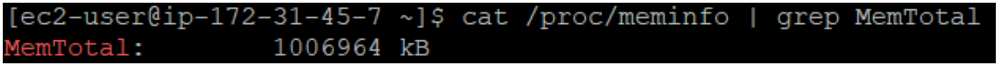
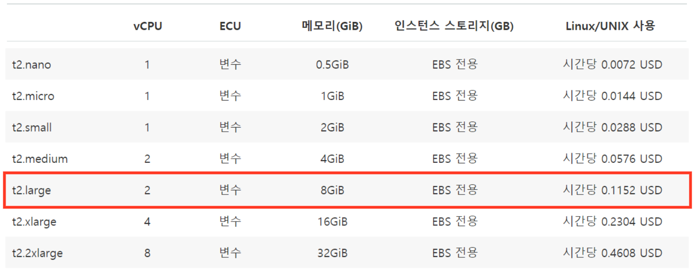
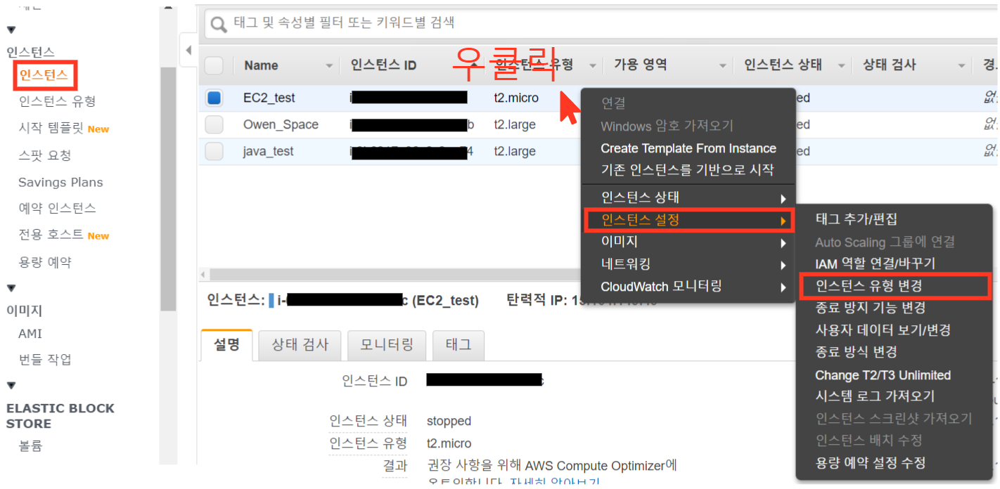
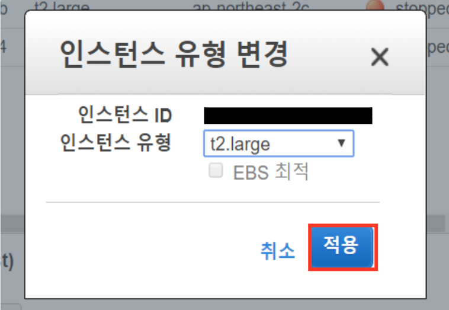
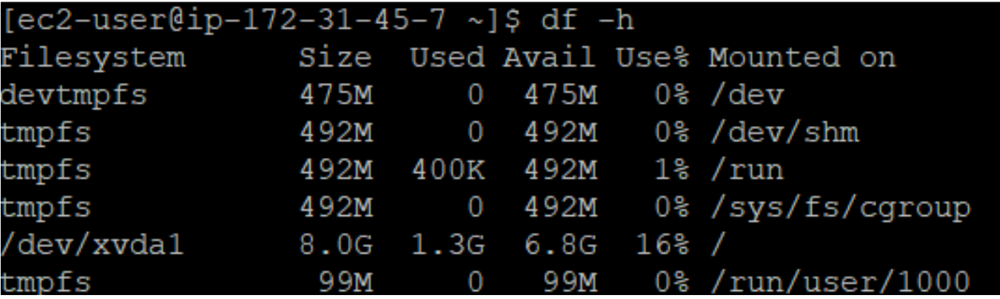
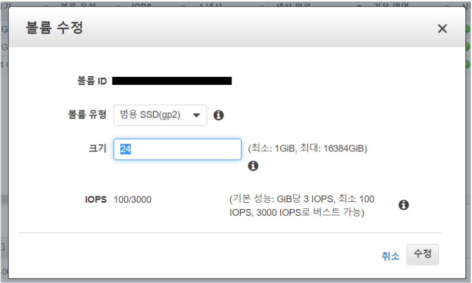

<head>
<script type="text/javascript">
(function(i,s,o,g,r,a,m) {i['GoogleAnalyticsObject']=r;i[r]=i[r]||function() {
(i[r].q=i[r].q||[]).push(arguments)},i[r].l=1*new Date();a=s.createElement(o),
m=s.getElementsByTagName(o)[0];a.async=1;a.src=g;m.parentNode.insertBefore(a,m)
})(window,document,'script','//www.google-analytics.com/analytics.js','ga');

ga('create', 'UA-145407326-3', 'auto');
ga('send', 'pageview');


</script>
</head>


<br>

<center>
{#id .class width="30%"}
</center>

<br><br>


이번에는 EC2의 추가 기능을 설정 해보려 한다. 앞선 블로그에서 EC2를 구축했지만 프리티어와 기본설정으로 생성해버려서 메모리와, 용량이 매우 낮다. (각각 1GB, 8GB) 그래서 이번에는 EC2에 인스턴스를 업그레이드 하고 용량을 8GB에서 24GB오 바꾸는 과정을 알아보자. 

# EC2 인스턴스 유형 변경

EC2 인스턴스 유형을 변경해보자. 변경 하려는 이유는 R을 실행하는데 있어서, 메모리가 부족할 경우 특정 패키지가 설치가 안되는 경우가 있더라. 당시에는 리눅스환경에 아무것도 모르는 상황이라 왜 안되는건가, 하루를 날렸는데 알아보니 프리티어 메모리가 1GB였고 패키지에서 원하는 메모리는 4GB였다. 그래서 인스턴스를 새로 지우고 다시 원하는 옵션에 맞게 구축 했으나, 알아보니 옵션으로 변경이 가능했었다. 다음을 보자.

<br>

## 메모리 확인 

우선 다음의 코드로 새로 구축한 인스턴스의 메모리를 보도록 하자. 1GB로 설정 되어 있으며 이를 8GB되는 인스턴스로 변경하려고 한다. Putty에서 서버를 키고 다음의 코드를 써주자.

```$ cat /proc/meminfo | grep MemTotal```

- 구글 키워드: 리눅스 메모리 용량 확인 

<br>

<center>
{#id .class width='100%'}
</center>

<br>

## 인스턴스 요금제 

인스턴스를 변경하기 전에 요금제를 보도록 하자. 요금제는 시간당 부과 되는 비용으로 서버를 키는 순간부터 비용이 발생한다. (참고로, 서버를 키고 바로 꺼도 AWS에서는 1분 사용량의 요금을 부과 한다.)  <br>
 이번에 우리가 바꿀 요금제는 t2.large요금제로 시간당 0.1152 USD가 부과 되며 이는 약 120원 정도라고 생각을 하면 되겠다.

- 출처: [Amazon EC2 요금](https://aws.amazon.com/ko/ec2/pricing/on-demand/)

<br>

<center>
{#id .class width='100%'}
</center>

<br>

## 인스턴스 요금제 변경 1

이제 본격적으로 요금제를 변경하자. 사실 간단하다. **중요한게 있담녀 하는데 있어서 반드시 서버를 종료 해놓은 상태에서 해야 안전하게 된다.**

- AWS - EC2 메뉴를 클릭
- 생성한 인스턴스 우클릭 
- 인스턴스 설정 - 인스턴스 유형 변경 클릭

<center>
{#id .class width='100%'}
</center>

<br>

## 인스턴스 요금제 변경 2

요금제는 t2.large로 변경 해주고 확인 버튼 클릭을 해주면 인스턴스가 변경 된다.

<center>
{#id .class width='70%'}
</center>

<br>

# EC2 인스턴스 볼륨 변경

이번엔 EC2의 8GB의 용량을 늘려보자. R studio, python, anaconda 등등 설치만 해도 많은 용량을 잡아 먹게 되는데, 데이터 양까지 많아 지면서 금방 한계에 부딪히는 낮은 용량이다. 아마존은 인스턴스의 용량을 30GB까지 무료로 제공을 해주고 있다.

<br>

## 용량 확인 

용량을 확인해보자. 이번에도 Putty에서 서버를 키고 확인을 해보자. 다음의 코드를 사용해보면 /dev/xvdal 에 총 용량이 어떻게 나와 있는가를 알 수가 있다. 자세하게 공부 하고 싶음녀 다음의 구글 키워드를 검색해보자.

```$ df -h```

- 구글 키워드: 리눅스 용량 확인

<center>
{#id .class width='100%'}
</center>

<br>

## 인스턴스 용량 변경 1

<center>
{#id .class width='100%'}
</center>


## 인스턴스 용량 변경 2

<center>
{#id .class width='70%'}
</center>