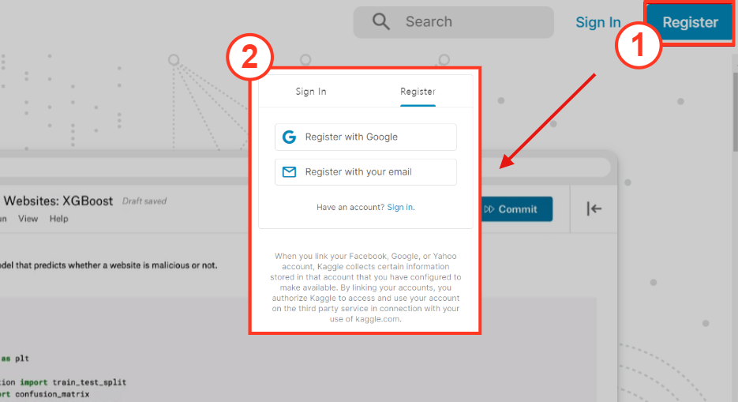
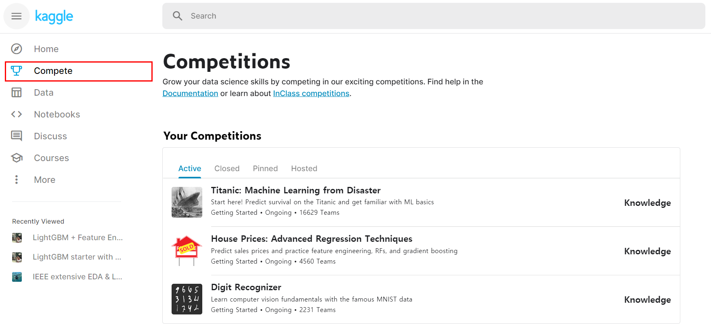
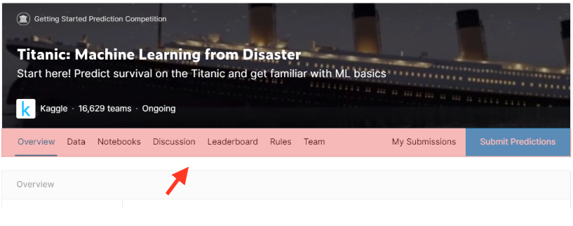
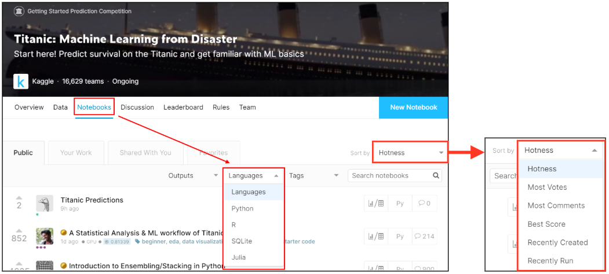

<head>

</head>

<header>

 

**Kaggle Beginner Guide** 

</header>

 

**최의용**   
**2020-03-18**

 

# 캐글 입문자를 위한 가이드 문서

데이터 분석을 공부하다보면 언젠가 듣는 이름이 있다. "캐글". 캐글이 뭔가 하고 검색을 해보면 **"2010년에 설립된 예측 모델 및 분석 대회 플랫폼으로 기업 및 단체에서 데이터와 해결과제를 등록하면, 데이터 과학자들이 이를 해결하는 모델을 개발하고 경쟁한다."** 라는 거창한 말과 함께, '아 이곳에서 데이터를 가지고 분석 경쟁을 하는구나~' 정도로만 알게 된다. 그러나 대다수가 캐글을 하는데 있어 상당한 진입장벽에 쉽게 포기를 하게 되더라. 그래서 이번에 캐글을 도전 해보고 싶었으나, 시도하기 엄두가 나지 않는 사람들을 위한 가이드를 한번 작성해보려 한다. 
 
  

# 캐글 기본 환경 파악

- 우선 회원가입부터 해보자. 캐글 우측 상단에 Register 버튼을 클릭하면 회원가입 절차 View로 넘어 가는데 되도록이면 gmail로 가입하는걸 권한다. 

- 회원가입이 되었다면 대회를 파악해보록 하자. 왼쪽 메뉴에 Compete버튼을 클릭하면 캐글에 존재하는 대회 들이 나오게 된다. 처음에는 기본적으로 Titanic이나 Bike sharing demand를 보면서 공부를 하면 된다. 우선 Titanic을 한번 보고 구조를 파악해보도록 하자.

  

**캐글 회원가입**

{#id .class width="100%"}

  

  

**캐글 대회 파악**

{#id .class width="100%"}

  

 

## 대회 메뉴 파악

각 대회의 메뉴를 파악 해보자. 여기까지는 간단하게 확인이 가능하다.

{#id .class width="100%"}

- Overview: 대회에 대한 전반적인 설명이 들어가 있다. 
- Data: 대회에 필요한 데이터와 그에 대한 설명이 들어 있다.
- Notebook: 다른사람들이 어떻게 데이터 분석을 했는지 코드를 올리는 공간이다. **이곳에서 많은걸 배울 수 있다.**
- Discussion: 대회에 대한 토론 장? 정도로 보자. 
- Leaderboard: 순위를 확인할 수 있다.
- Rules: 대회 규칙
- Team: 나의 정보? 정도로 알아두자.
- My submissions: 데이터 분석한 결과를 확인할 수 있다.
- Submit Predictions: 데이터 분석한 결과를 제출하는곳.  

  

# 캐글 입문 시작

지금부터가 **본론**이다. 사실 위 이야기는 가입부터 약 5분이면 간단하게 확인할 수 있는 내용이고, 지금부터 진입장벽을 깰 수 있는 이야기를 해보려 한다. Titanic를 예시로 들었으니, 어떻게 Titanic를 가지고 공부를 하는게 좋을지 알아보도록 하자. 

 

## 필사를 위한 자료 수집

캐글을 하려면 처음엔 필사를 하라고 하는데, 어떻게 필사를 하는게 좋을까? 다른사람들이 작업 결과들을 공부 하는게 가장 효과적이다. 다음 그림은 Titanic에 올라온 Notebook을 확인 하는 절차를 나타냈다.

### 
 

{#id .class width="90%"}

{#id .class width="90%"}

{#id .class width="90%"}

---

- [R 마크다운 실무](https://statkclee.github.io/comp_document/rmarkdown-in-production.html)
